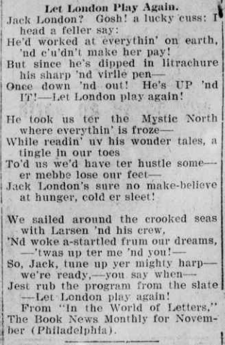

```{r setup, include=FALSE}
knitr::opts_chunk$set(echo=TRUE, tidy=TRUE)
if (!(require(dplyr))) {
  install.packages("dplyr", repos = "http://cran.us.r-project.org")
}
if (!(require(stringr))) {
  install.packages("stringr", repos = "http://cran.us.r-project.org")
}
if (!(require(knitr))) {
  install.packages("knitr", repos = "http://cran.us.r-project.org")
}
library("dplyr")
library("stringr")
library("parallel")
library("knitr")
```

Welcome! In this workshop we'll be exploring one technique and one kind of dataset: fuzzy string matching in R and a batch of digitized newspapers from Chronicling America.^[My thanks to Nicole Sheriko and Andrew Goldstone for their feedback and advice on portions of the code included here.]

The first step is to download the newspaper batch we'll be using [from Chronicling America](https://chroniclingamerica.loc.gov/ocr/). The batch we'll be working with is called `allspice`; it consists of the *Perth Amboy Evening News* from March 1903 to March 1907. Once downloaded, unzip the tarball; this will take a few more minutes. The result will show up as a single directory with the name "sn85035720": this is Chronicling America's ID for the *Perth Amboy Evening News*, so we'll leave it that way.

Before we get any further into the news, though, we should familiarize ourselves with fuzzy string matching.

#Levenshtein Distances and Fuzzy String Matching
The first obstacle to doing quantitative analysis on digitized newspapers - or even just finding a search term - is the messiness of newspaper Optical Character Recognition (OCR). This is a problem for all periodicals, but it's an especially big one for newspapers, many of which were printed on low-quality paper with small fonts and received minimal preservation attention. If we're going to make use of this wealth of data, we need to be able to work around persistent, inconsistent OCR errors. 

Say we're trying to find a name, the surname of postbellum American author Mary Murfree, from among a *vector* of *strings* (a series of words).

```{r, tidy=TRUE}
test_vector <- c("murfree", "muurfree", "nurfree", "murfre", "murrfee", "murphee", 
                 "durpree", "free", "smurffree", "murfreesboro", "marymurfree")
```

At least one of these words is perfectly correct ("murfree") and some of them are obviously not what we're looking for ("durpree"), but some of them are quite probably just OCR errors ("nurfree"). R has a conventional search function for exact *character patterns* (for our purposes, words): `grep`. Unsurprisingly, it doesn't do us much good here.

```{r}
search_hits <- grep("murfree", test_vector)
search_hits
test_vector[search_hits]
```

`grep` returns a vector of the *numeric position* of each *element* in the desired vector (`test_vector`) in which our desired character pattern ("murfree") occurs. To return a vector of the strings themselves - the elements of `test_vector` and not just their numeric position - we *index* our vector of `search_hits` positions *into* our `test_vector` of strings, with brackets. Note that `grep` also includes strings longer than our search pattern. This is basically the result we'd get if we searched for a particular word via the Chronicling America's search API. Thankfully, R has something much better for us: `agrep`.

```{r}
search_hits <- agrep("murfree", test_vector, max.distance=2)
test_vector[search_hits]
```

`agrep` allows us to get fuzzy; it returns all elements of a vector in which an approximate match to our character pattern occurs, within a specified Levenshtein Distance (`max.distance=`). Levenshtein distance is simply the number of insertions (internal added characters), deletions (deleted characters), and substitutions (characters replaced by other characters) it takes to get from one string to another (Table 1).

```{r levenshtein table, echo=FALSE}
Edit <- c("Insertion", "Deletion", "Substitution")
String <- c("muurfree", "murfre", "nurfree")
Difference <- c("+u", "-e", "m->n")
Distance <- c("1", "1", "1")
frame <- data.frame(String, Difference, Distance, Edit)
kable(frame, caption="A few Levenshtein Distances")
```

A Levenshtein Distance of two is clearly a bit too capacious for this test dataset, though, so let's try again:

```{r}
search_hits <- agrep("murfree", test_vector, max.distance=1)
test_vector[search_hits]
```

By cutting the `max.distance` down to one, we're able to filter out a few more things we didn't want ("murphee" and "durpree") - but notice we also lost one string we probably *did* want to keep, "murrfee". Our goal in setting a `max.distance` is to minimize the number of false negatives (the strings we do want that our search fails to identify) *and* false positives (the search hits that we don't actually want).

We're still getting some garbage though, for the same reason `grep` gave us additional hits: `agrep` also includes strings longer than our search pattern so long as something within distance of that pattern occurs within the string. We can solve this issue by taking the results of our last `agrep` call and filtering out anything more than one character longer than "murfree":

```{r}
search_hits <- which(nchar(test_vector[search_hits]) < nchar("murfree")+2)
test_vector[search_hits]
```

By adding a length limit to our search hits, we can finally get rid of some more pesky strings we didn't want. Once again, though, this comes at a cost: we've lost "marymurfree," which is certainly a false negative. If we wanted to be even more precise, we could address this. We might run an additional `grep` call that looks specifically for the pattern "marymurfree" and combine its results with the results of our `agrep` call. Perhaps we're worried that the OCR software has a tendency to split "murfree" into separate words, like "mur" and "free"; we could write some additional code to `paste` each string together with each string immediately adjacent to it before calling `grep` and then combine those results with the results of our `agrep` call.

Our code will run slower, however, the more intricate our search gets. On a small dataset or even a large dataset and a lot of time, this might not be a problem. But even working with a few years of a single paper is a sizeable chunk of data: 9,632 pages containing around 38 million words that can take up over 540 Mb of memory. Furthermore, no matter how precise we get, at the end of the day fuzzy string matching is always a gamble: with enough data, we will always have false positives and false negatives.

#Data Familiarity and Setting Up an Input Matrix
Now let's turn to the *Perth Amboy Evening News*. Chronicling America datasets come highly structured; open up your downloads folder and familiarize yourself with it for a bit. You'll notice the file directory is structured something like this: "/Users/ahl80/Downloads/[paper ID]/[year]/[month]/[day]/[edition]/[page]". Once you get all the way to the bottom of things, you'll see two files: a plain old .txt file and an .xml file that indicates the position of the text on the page. 

The .txt file is the only one we want - and in fact, we *do not* want the .xml files, which take up tons of space. This next line of code uses wildcards to remove all files with the .xml extension within the exact number of directories specified by asterisk. Change the names or number of the directories prior to "sn85035720" to match the file path on your computer, but **do not** remove "sn85035720" or change anything after it: we don't want to go removing other things from your computer.

```{r}
unlink(Sys.glob(file.path("/Users/ahl80/Downloads/sn85035720/*/*/*/*/*", "*.xml")))
```

In order to run our search, we need to figure out the file paths for our data to the desired degree of metadata specificity. For starters, let's say we only want to keep track of the year and the month in which each hit occurs. We can find each month for which we have data (and the year to which that month belongs) with a simple `for` *loop*:

```{r, tidy=TRUE, eval=TRUE}
years <- list.files("/Users/ahl80/Downloads/sn85035720")
# a list of each year we have data for

for (k in seq_along(years)) {
  # for each year of data, we're going to...
  
  months <- list.files(paste("/Users/ahl80/Downloads/sn85035720/", years[k], sep=""))
  # ...make a vector that lists each month we have data for...
  
  one_year <- matrix(c(rep(years[k], each=length(months)), months), length(months))
  # ...make a matrix where each month appears in its own row with the year...
  
  if (exists("full_span")) {
    full_span <- rbind(full_span, one_year)
  } else {
    full_span <- one_year
  }
  # ...and then combine the matrix for that year with the matrix of all the other years
}
```

The result (the first fourteen rows of it, that is) is a matrix that looks like this:

```{r}
print(full_span[1:12,])
```

If we wanted a bit more finely grained analysis, keeping track of hits by day and not just by month, we can add a nested `for` loop. This is essentially just the same thing repeated: `days` does the same thing as `months` but for, well, days; `one_month` makes the result into a matrix just like `one_year` did, with the difference that our matrix would have three columns (one for each day).

```{r, tidy=TRUE, eval=FALSE}
for (k in seq_along(years)) {
  months <- list.files(paste("/Users/ahl80/Downloads/sn85035720/", years[k], sep=""))
  for (j in seq_along(months)) {
    days <- list.files(paste("/Users/ahl80/Downloads/sn85035720/", 
                             years[k], "/", months[j], sep=""))
    one_month <- matrix(c(rep(years[k], each=length(days)), 
                          rep(months[j], each=length(days)), days), length(days))
    if (exists("full_span")) {
      full_span <- rbind(full_span, one_month)
    } else {
      full_span <- one_month
    }
  }
}
```

But we want to get even more precise and keep track of the page on which each hit occurs. (After all, page placement in a newspaper matters: it makes a difference whether something is printed on the front page or on the back page with all the ads.) So we just add another nested `for` loop:

```{r, tidy=TRUE, eval=TRUE}
rm(years, full_span)
years <- list.files("/Users/ahl80/Downloads/sn85035720")

for (k in seq_along(years)) {
  months <- list.files(paste("/Users/ahl80/Downloads/sn85035720/", years[k], sep=""))
  for (j in seq_along(months)) {
    days <- list.files(paste("/Users/ahl80/Downloads/sn85035720/", 
                             years[k], "/", months[j], sep=""))
    for (i in seq_along(days)) {
      pages <- list.files(Sys.glob(paste("/Users/ahl80/Downloads/sn85035720/", 
                                  years[k], "/", months[j], "/", days[i], "/*",  sep="")))
      one_day <- matrix(c(rep(years[k], each=length(pages)), 
                          rep(months[j], each=length(pages)), 
                          rep(days[i], each=length(pages)), pages), length(pages))
      if (exists("full_span")) {
        full_span <- rbind(full_span, one_day)
      } else {
        full_span <- one_day
      }
    }
  }
}

print(full_span[1:12,])
```

Great: now we have a matrix of all the metadata we want to retain from the Chronicling America file structure. (Similarly, if we were working with multiple newspapers, we would start with using `list.files` to find all the directories in our downloads that start with "sn.")

#Running a Search and Grabbing Collocates
Now it's time to start putting things together. First we'll make our own function, `searchfun`, that takes a line of our input matrix - a year, a month, a day, and a page - and finds all approximate matches using the `agrep` code we wrote earlier. It needs to be written as a function because that way we can easily run it multiple times, i.e., for each page. But it does one other thing as well: it also returns the twenty strings on either side of each hit, or collocate strings. This takes little extra time and will come in very handy later. In this example, I've used postbellum American author Jack London as my search.

```{r, tidy=TRUE, warning=FALSE}
searchfun <- function (year, month, day, page) { 
  # the name of our function and the four variables it requires to run
  
  file_path <- paste("/Users/ahl80/Downloads/sn85035720/", 
                     year, "/", month, "/", day, "/*/", page, sep="")
  # first we assemble the file path to reach the page
  
  one_page <- unlist(strsplit(unlist(lapply(
                        Sys.glob(file.path(file_path, "*.txt")), 
                            readLines)), "\\W+"))   
  one_page <- tolower(one_page[one_page != ""]) 
  # then read that page into memory, split it into words, and make everything lowercase
  
  forename <- agrep("jack", one_page, max.distance=1)
  forename <- forename[which(nchar(one_page[forename]) < nchar("jack")+2)]
  # here are the two lines for fuzzy string matching from earlier
  
  surname <- agrep("london", one_page[forename+1], max.distance=1)
  surname <- surname[which(nchar(one_page[forename[surname]+1]) < nchar("london")+2)]
  # these lines are basically the same, except they only check the strings immediately 
  # following the hits identified in our previous search, `forename`
  
  collocates <- lapply(surname, 
                    function(x) if (forename[x] < 21) {
                       paste(one_page[1:(forename[x]+22)], collapse=" ")
                    } else {
                       paste(one_page[(forename[x]-20):(forename[x]+22)], collapse=" ")
                    })
  # this is where we grab collocate strings (for ease of storage, we'll paste them all 
  # into one string for now); we're indexing with `surname` because we only want to keep 
  # track of instances of forename immediately followed by surname. we use `if` in order
  # to avoid getting a negative subscript (i.e., when the desired string appears at the
  # start of a page)
  
  tot_pg <- length(list.files(Sys.glob(paste("/Users/ahl80/Downloads/sn85035720/", 
                     year, "/", month, "/", day, "/*/", sep=""))))
  # this finds the total number of page files for the issue; it'll be useful later
  
  rm(one_page, forename, surname)  
  gc()
  # this clears our page data out of memory now that we're done with it
  
  if (length(collocates)==0) {
    return()   
    # if there are no hits, nothing will happen
    
    } else {
    return(data.frame(LCCN="sn85035720", Year=year, Month=month, Day=day, Page=page, 
                      Issue_Length=tot_pg, Collocates=I(collocates)))}
    # if there are hits, we return the date, page, issue length, and collocates for each
}
```

Now it's time to decide who or what two-word sequence to search for. To help decide, [bring up Chronicling America](https://chroniclingamerica.loc.gov/) before running your search. In the Advanced Search tab, select New Jersey under the State field and run a quick Phrase Search for the name or phrase you're considering to see how many hits you get. Ideally, in order to balance the amount of time this will take with the amount of data it'll produce, you should aim for someone or something with around 100 hits on Chronicling America.

Once you've done that, change both instances of "jack" and "london" to the two names or words you've decided on and run the batch of code above.

In order to make sure things don't take too long, we'll wrap our search function in another function that distributes the workload across multiple processor cores.

```{r, warning=FALSE}
decade_par <- function (input_matrix) {
  core_num <- detectCores()-1
  clust <- makeCluster(core_num, outfile="")
  clusterExport(clust, varlist=c("input_matrix"), envir=environment())
  clusterExport(clust, varlist=c("searchfun"))
  result <- do.call(rbind, parLapply(clust, seq_len(nrow(input_matrix)),
                              function(x) do.call(searchfun, as.list(input_matrix[x,]))))
  # this is where the magic happens: it runs `searchfun` once for each row of the 
  # `input_matrix` and then binds the results together
  
  stopCluster(clust)
  return(result)
}
```

Finally, let's run the actual search! This will take a couple minutes.

```{r}
hits <- decade_par(full_span)
```

Now if all has gone well, the output of this function, `hits`, will be a data frame in which each row contains the metadata and collocate string for each hit:

```{r}
if (nrow(hits) > 25) {
  print(hits[1:25,])
} else {
  print(hits)
}
```

Nice and tidy data: this will make further analysis a breeze. Our work has paid off!

You may be wondering: how useful was fuzzy string matching after all? We can see how many hits an exact search would've missed by doing an exact pattern search (with `grep`) to see how many of our collocate strings contain it and subtracting this number from the total number of hits:

```{r}
nrow(hits) - length(grep("jack london", hits$Collocates))
```

And now the follow-up question: are these extra hits actually matches or are they false positives? Let's take a look at their collocate strings. To do so, we'll use the `-` sign for negative indexing, to return all collocate strings that don't contain the exact character pattern "jack london"; then we'll split the big collocates string (with `str_split`) into separate strings wherever there's a space (" ").

```{r}
str_split(hits$Collocates[-grep("jack london", hits$Collocates)], " ")
```

These look pretty good: four are explicitly about London's fiction (1, 3, 4, and 5), two are about London's own travel plans (6 and 7), and one particularly fun result is a poem about wanting London to write more (8) (Figure 1). Only one of these (2) is a false positive: it's a snippet called "London Tit-Bits" that just happens to be preceded by the word "back."

Seven out of eight is pretty good, especially when the collocates are as clean as they are here: this additional word data will enrich any future analysis. Our high success rate of recovering false negatives might lead us to try a slightly fuzzier search. We could, for example, change the `agrep` `max.distance` to 2 for "london"; this might open the garbage floodgates, but it could recover enough additional false negatives to be worthwhile. Fuzzy string matching is always a matter of trial and error.



The utility of fuzzy string matching can vary considerably based on [1] the distinctiveness of the desired character pattern, and [2] the messiness of the OCR data. The OCR for the *Perth Amboy Evening News* is comparatively clean for a newspaper - thanks to a lot of great work by Caryn Radick and the rest of the [New Jersey Digital Newspaper Project](https://blogs.libraries.rutgers.edu/njdnp/) team! - though still not as clean as, say, hathitrust.org scans of a magazine volume. It may be that fuzzy string matching isn't all that useful in a particular case, but you'll find that the payoff always increases as you increase the size of the newspaper dataset.

The `write.csv` function will save the results to a .csv (a bare-bones spreadsheet) for fast and easy access in the future: change the name (but not the ".csv" extension) as desired. If you're planning on coming to Part 2 of this workshop, save this file to a flashdrive or cloud drive and you'll be able to pick up right where you left off.

```{r}
write.csv(hits, "name-this-file.csv")
```

Finally, we would really appreciate it if you took a minute to [fill out our brief feedback survey](https://rutgers.ca1.qualtrics.com/jfe/form/SV_e3OFcMS6wF3rdWJ).

Thanks for participating!
